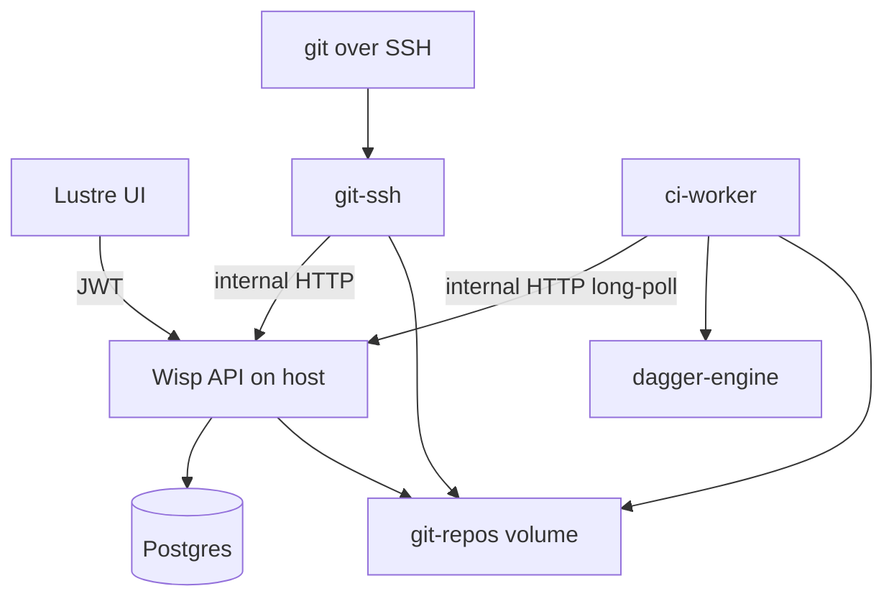

# Gleamhub

Gleam-native Git hosting: Clerk sign-in, orgs and repos in the browser, SSH clone/push/pull, merge requests with optional Dagger CI.

## Features

### Authentication

- Sign in and sign out via [Clerk](https://clerk.com/)
- User menu with SSH keys, account settings, and sign out
- All routes require authentication - no anonymous browsing

### Organizations

- Create organizations (name + slug)
- List organizations you belong to
- Search and filter repositories on the org page
- Roles: **owner** (full control) and **member** (read/write repos)
- Invite members by Clerk username (owners choose **member** or **owner** role)
- Promote or demote members between owner and member (owners only; last owner cannot be demoted or removed)
- Accept or decline invitations from the user menu

### Repositories

- Create, browse, and delete repositories (delete: owners only)
- Rename repositories (owners only, Settings → General)
- README preview on the repo home page
- Copy SSH clone URL to clipboard
- Org members with a registered SSH key can read and write all repos in that org (no per-repo ACL)

### Git over SSH

- Clone, fetch, pull, and push via `ssh://git@<host>:<port>/{org}/{repo}.git`
- Register and manage SSH public keys at **Settings → SSH keys**
- **pre-receive** hook blocks direct pushes to protected branches
- **post-receive** hook enqueues CI when pushing to an open merge request’s source branch

### Code browsing

- Switch branches on home, tree, blob, and commit views
- File tree and blob views with syntax highlighting (highlight.js)
- Raw file view and per-file download; zip archive of a branch from the repo home page
- Line permalinks on blobs (`#L42`, `#L10-L25`) with scroll-to-line
- Commit history and commit detail (view repo at a specific SHA)
- Copy commit SHA from the commit list and MR Commits tab

### Tags and releases

- Browse git tags pushed to the remote (name, commit, date, tag message)
- Create a release for an existing tag: title and markdown release notes (org writers and owners)
- Release page links to the commit at the tag SHA and offers **Source code (zip)** / **Source code (tar.gz)** downloads at the tag
- Tags are created locally with git, then pushed to Gleamhub:

```bash
git tag v1.0.0
git push origin v1.0.0
```

Tag protection rules are not implemented yet (see [docs/backlog/14-richer-protected-branches.md](docs/backlog/14-richer-protected-branches.md)).

### Issues

- Create, list, search, comment on, and close issues
- Issue templates loaded from the default branch (`.gleamhub/issue_template.md`, `.gleamhub/ISSUE_TEMPLATE.md`, or multiple templates via `.gleamhub/issue_template/*.md`)
- Markdown-rendered descriptions and timeline UI
- Issue metadata stored in Postgres (not in git objects)

### Merge requests

- Create merge requests between branches; duplicate open MRs for the same source→target pair are prevented
- **Conversation** - description, general comments, merge and close actions
- **Checks** - CI pipeline status, live log via SSE, prior run history
- **Commits** - commits on the source branch
- **Changes** - per-file diff viewer, inline review comments (hover a line, click **+**), diff line permalinks, filter to commented files only
- **Update branch** - merge latest target into source when the target has moved ahead
- **Merge methods** - create merge commit (default) or squash and merge; optionally delete the source branch after merge
- **Close** - author or any org writer can close an open MR
- View conflict files when merge conflicts exist
- MR templates loaded from the target branch (`.gleamhub/merge_request_template.md` and alternate paths; multiple templates via `.gleamhub/merge_request_template/*.md`)

### CI / checks (optional)

Requires the [CI stack](#optional-merge-request-ci) in addition to the main services.

- Opt-in Dagger pipelines - commit a module at `.dagger/dagger.json`, `ci/dagger.json`, or `dagger/dagger.json` with a `ci` entry function
- Runs on MR open, push to an open MR’s source branch, and manual **Re-run checks**
- Merge gating: blocked while CI is running or failed; allowed when skipped (no module) or successful at current HEAD
- Test locally with `dagger call -m ./ci ci --source=.`

Full contract and troubleshooting: [docs/ci-platform.md](docs/ci-platform.md).

### Repository settings (owners only)

- Rename repository
- Protected branches - direct SSH pushes (including force-push and deletion) are denied; MR merge still works via server-side `git update-ref`
- Delete repository (with confirmation)

Tags are not protected in this MVP.

---

## Quick start

**You need:** [Docker](https://www.docker.com/), a [Clerk](https://clerk.com/) app (or the example env files), and-for local Gleam/Node work-[asdf](https://asdf-vm.com/) or [mise](https://mise.jdx.dev/):

```bash
git clone https://github.com/nathanjohnson320/gleamhub.git
cd gleamhub
asdf install   # or: mise install - reads .tool-versions (gleam, erlang, nodejs)
```

```bash
# 1. Env files (edit only if you use your own Clerk app - see below)
cp .env.example .env
cp server/.env.example server/.env
cp ui/.env.example ui/.env

# 2. Postgres + git-ssh (API runs on the host - see step 3)
docker compose up --build -d

# 3. Migrations + API
cd server && npm install && npm run db:up && gleam run
```

In a **second terminal** (hot-reload UI):

```bash
cd ui && npm install && npm run dev
```

| What | URL |
|------|-----|
| API (`gleam run` in `server/`) | http://localhost:9999 |
| App (Vite dev) | http://localhost:5173 |
| Git SSH | `ssh://git@localhost:2222/{org}/{repo}.git` |

Sign in → **Organizations** → create an org → add a repo → **SSH keys** → paste your public key → clone/push (see [Try git over SSH](#try-git-over-ssh)).

### Optional: merge request CI

Merge-request pipelines are **not** started by `docker compose up` alone. After Postgres, git-ssh, and `gleam run` are running, start the CI profile:

```bash
docker compose --profile ci up --build -d
```

| Piece | How it runs |
|-------|-------------|
| Postgres + git-ssh | `docker compose up` |
| Gleamhub API | `gleam run` in `server/` |
| CI worker + Dagger | `docker compose --profile ci up` |

Keep **`INTERNAL_API_TOKEN`** the same in `/.env` and `server/.env` (examples default to `dev-internal-token-change-me`). The worker calls the API at `http://host.docker.internal:9999` by default. On **Linux**, if jobs never run, set `GLEAMHUB_API_URL=http://172.17.0.1:9999` in `/.env` and restart the CI stack.

### Clerk (only if example keys do not work)

Use **one** Clerk application for both server and UI.

1. [Clerk Dashboard](https://dashboard.clerk.com/) → your app → **API keys** → copy **Publishable key** into `ui/.env`:

   ```bash
   VITE_CLERK_PUBLISHABLE_KEY=pk_test_...
   ```

2. Set the Clerk JWKS URL in **both** `/.env` (for Docker) and `server/.env` (for local `gleam run`):

   ```bash
   CLERK_JWKS_URL=https://<your-clerk-domain>/.well-known/jwks.json
   CLERK_SECRET_KEY=sk_test_...
   ```

   The server fetches this JWKS document once at boot and uses all published signing keys for JWT verification.

3. Restart: `docker compose up --build -d`, then `gleam run` in `server/` (and `npm run dev` in `ui/` if it was already running).

If the UI shows **Unauthorized**, `CLERK_JWKS_URL` and `VITE_CLERK_PUBLISHABLE_KEY` are from different Clerk apps or the JWKS fetch failed at boot.

---

## Try git over SSH

After creating org `acme` and repo `demo` in the UI:

```bash
git clone ssh://git@localhost:2222/acme/demo.git
cd demo
echo "# hello" >> README.md
git add README.md && git commit -m "init"
git push origin main
```

If the host key changed after a container rebuild:

```bash
ssh-keygen -R '[localhost]:2222'
```

Bare repos on disk: `$GIT_REPOS_ROOT/{org_slug}/{repo}.git` (default `./server/data/repos` locally).

---

## Local development

Use this when changing server or UI code without rebuilding Docker images. If you already completed [Quick start](#quick-start), skip the `cp` steps and reuse your env files.

```bash
# Terminal 1 - database
docker compose up postgres -d

# Terminal 2 - API
cd server
cp .env.example .env    # skip if already copied
npm install && npm run db:up && gleam run

# Terminal 3 - git SSH
docker compose up git-ssh -d

# Terminal 4 - UI
cd ui && npm install && npm run dev
```

Vite proxies `/api` to port 9999. `git-ssh` uses `GLEAMHUB_API_URL=http://host.docker.internal:9999` by default (Mac/Windows). On Linux, set `GLEAMHUB_API_URL=http://172.17.0.1:9999` in `.env` if needed.

**SQL changes:** edit `server/src/sql/*.sql`, then `cd server && npm run db:up && npm run db:gen:sql`.

**Ship UI into the server static bundle:** `cd ui && npm run build` (writes to `server/priv/static`).

See also [server/README.md](server/README.md) and [ui/README.md](ui/README.md).

---

## Architecture



| Path | Role |
|------|------|
| `server/` | Wisp API, Postgres (pog), migrations, git browse/MR/issue APIs |
| `ui/` | Lustre + Vite + Clerk SPA |
| `git-ssh/` | OpenSSH + hooks calling internal API |
| `ci-worker/` | Gleam OTP worker: long-poll jobs, clone repo, run Dagger, upload logs |
| `common/` | Shared Gleam types (minimal; used by server) |
| `docs/` | Operator and repo-author docs (e.g. [ci-platform.md](docs/ci-platform.md)) |
| `docker-compose.yml` | Postgres + git-ssh; CI worker + Dagger engine with `--profile ci` |
| `docker-compose.test.yml` | Ephemeral Postgres for `gleam test` (port 5433) |

---

## API surface

All `/api/*` routes require a Clerk JWT unless noted. Org-scoped routes require org membership; write actions require org **write** or **owner** as documented.

### Public API (Clerk JWT)

| Route | Notes |
|-------|-------|
| `GET /api/me` | Current user |
| `GET/POST /api/orgs` | List / create orgs |
| `GET /api/orgs/:slug` | Org detail |
| `GET/POST /api/orgs/:slug/repos` | List / create repos |
| `GET/DELETE /api/orgs/:slug/repos/:name` | Repo detail / delete |
| `GET .../repos/:name/branches` | Branch list |
| `GET .../repos/:name/readme?ref=` | README at ref |
| `GET .../repos/:name/tree/:ref/...` | Directory listing |
| `GET .../repos/:name/blob/:ref/...` | File contents |
| `GET .../repos/:name/raw/:ref/...` | Raw file (`?download=1` for attachment) |
| `GET .../repos/:name/archive/:ref.zip` | Zip archive at ref |
| `GET .../repos/:name/archive/:ref.tar.gz` | Gzip tarball at ref |
| `GET .../repos/:name/commits?ref=` | Commit log |
| `GET .../repos/:name/commit?sha=` | Single commit |
| `GET/PUT .../repos/:name/protected-branches` | Read (member); update (owner) |
| `GET/POST .../repos/:name/issues` | List / create issues |
| `GET .../issues/template?ref=` | Issue templates at ref |
| `GET .../repos/:name/issues/:num` | Issue detail |
| `POST .../repos/:name/issues/:num/close` | Close issue |
| `GET/POST .../repos/:name/issues/:num/comments` | Issue comments |
| `GET/POST .../repos/:name/merge-requests` | List / create MRs |
| `GET .../merge-requests/template?ref=` | MR templates at ref |
| `GET .../merge-requests/:number` | MR detail (+ merge check + pipeline) |
| `GET .../merge-requests/:number/commits` | MR commits |
| `GET .../merge-requests/:number/diff?path=` | Per-file patch |
| `GET/POST .../merge-requests/:number/comments` | MR / inline comments |
| `POST .../merge-requests/:number/merge` | Merge (write) |
| `POST .../merge-requests/:number/close` | Close (author or write) |
| `POST .../merge-requests/:number/rerun-checks` | Re-queue CI (write) |
| `GET .../merge-requests/:number/pipeline/stream` | SSE pipeline updates (Checks tab) |
| `GET/POST/DELETE /api/ssh-keys` | SSH key management |

### Internal API (`X-Gleamhub-Internal-Token`)

| Route | Caller |
|-------|--------|
| `GET /internal/ssh/authorized_keys` | git-ssh |
| `GET /internal/ssh/access` | git-ssh |
| `POST /internal/ssh/ref-update` | pre-receive hook |
| `POST /internal/ci/enqueue` | post-receive hook |
| `GET /internal/ci/jobs/next` | ci-worker (long-poll) |
| `PATCH /internal/ci/jobs/:id` | ci-worker (state + log) |

---

## Environment variables

| Variable | Where | Description |
|----------|-------|-------------|
| `CLERK_JWKS_URL` | `/.env`, `server/.env` | Clerk JWKS URL fetched at boot for JWT verification |
| `CLERK_SECRET_KEY` | `server/.env` | Clerk secret key for Backend API user lookups |
| `VITE_CLERK_PUBLISHABLE_KEY` | `ui/.env` | Clerk publishable key |
| `SECRET_KEY_BASE` | `/.env`, `server/.env` | Wisp session signing |
| `DATABASE_URL` | `server/.env` | Postgres (see `server/.env.example`) |
| `GIT_REPOS_ROOT` | `server/.env` | Bare repo directory |
| `GLEAMHUB_GIT_HOST` | `server/.env` | Hostname in clone URLs (`localhost`; use e.g. `git.example.com` when hosted) |
| `GLEAMHUB_GIT_PORT` | `server/.env` | SSH port in clone URLs (`2222` locally; `22` for standard SSH) |
| `GLEAMHUB_API_URL` | `/.env` | git-ssh / CI worker → API URL when server runs on host |
| `INTERNAL_API_TOKEN` | `/.env`, `server/.env` | Shared secret for git-ssh hooks and CI worker |

CI worker variables are documented in [docs/ci-platform.md](docs/ci-platform.md).

---

## Tests

**Server** (integration tests use ephemeral Postgres on port **5433**):

```bash
cd server && npm install && gleam test
```

`gleam test` starts `docker-compose.test.yml`, runs migrations, runs the suite, then tears down. Requires Docker.

Filter tests: `gleam test merge_request_routes_integration_test`

**UI:** `cd ui && gleam test`

---

## Deployment

Single-platform deployment: one Wisp process, one git-ssh service, one Postgres, one shared repo volume. For MR CI, add the Dagger engine and `ci-worker` stack ([docs/ci-platform.md](docs/ci-platform.md)).

### Git over SSH (hosted)

1. **DNS** - Point a git hostname (e.g. `git.example.com`) at the host or load balancer that terminates SSH for `git-ssh`.
2. **Clone URLs** - Set `GLEAMHUB_GIT_HOST` and `GLEAMHUB_GIT_PORT` in `server/.env` (`22` omits the port from URLs). Restart the API.
3. **Expose SSH** - Publish `git-ssh` on the same host/port (e.g. `22:22` or `2222:22`). The advertised port must match what clients connect to.
4. **Internal API** - On `git-ssh`, set `GLEAMHUB_API_URL` to the API’s reachable URL on the Docker network (e.g. `http://server:9999`). Keep `INTERNAL_API_TOKEN` identical in both environments. Share `GIT_REPOS_ROOT` with the API.

Example production `server/.env`:

```bash
GLEAMHUB_GIT_HOST=git.example.com
GLEAMHUB_GIT_PORT=22
```

Example `git-ssh` environment:

```bash
GLEAMHUB_API_URL=http://server:9999
INTERNAL_API_TOKEN=<same as server>
GIT_REPOS_ROOT=/data/repos
```

## License

MIT - see [LICENSE.md](LICENSE.md).
