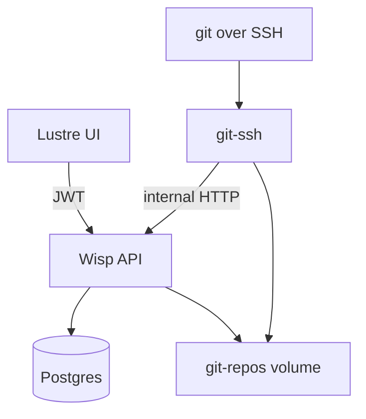

# Gleamhub

Gleam-native Git hosting MVP: Clerk sign-in, orgs/repos in the browser, SSH clone/push/pull to bare repos on disk.

## 5-minute setup

**You need:** [Docker](https://www.docker.com/), a [Clerk](https://clerk.com/) app (or the example env files), and—for local Gleam/Node work—[asdf](https://asdf-vm.com/) or [mise](https://mise.jdx.dev/):

```bash
git clone https://github.com/nathanjohnson320/gleamhub.git
cd gleamhub
asdf install   # or: mise install — reads .tool-versions (gleam, erlang, nodejs)
```

```bash
# 1. Env files (edit only if you use your own Clerk app — see below)
cp .env.example .env
cp server/.env.example server/.env
cp ui/.env.example ui/.env

# 2. Postgres + git-ssh (API runs on the host — see step 3)
docker compose up --build -d

# 3. Migrations + API
cd server && npm install && npm run db:up && gleam run
```

In a **second terminal** (hot-reload UI — recommended for frontend work):

```bash
cd ui && npm install && npm run dev
```

| What | URL |
|------|-----|
| API (`gleam run` in `server/`) | http://localhost:9999 |
| App (Vite dev — use this while hacking UI) | http://localhost:5173 |
| Git SSH | `ssh://git@localhost:2222/{org}/{repo}.git` |

Sign in → **Organizations** → create an org → add a repo → **SSH keys** → paste your public key → clone/push (see [Try git over SSH](#try-git-over-ssh)).

### MR CI (optional)

Merge-request pipelines are **not** started by `docker compose up` alone. After steps 2–3 above (Postgres, git-ssh, and `gleam run` on the host), start the CI stack:

```bash
# from repo root — Dagger engine + worker (long-polls the API for jobs)
docker compose -f docker-compose.ci.yml up --build -d
```

| Piece | How it runs |
|-------|-------------|
| Postgres + git-ssh | `docker compose up` (step 2) |
| Gleamhub API | `gleam run` in `server/` (step 3) |
| CI worker + Dagger | `docker compose -f docker-compose.ci.yml up` |

Keep **`INTERNAL_API_TOKEN`** the same in `/.env` and `server/.env` (the examples default to `dev-internal-token-change-me`). The worker calls the API at `http://host.docker.internal:9999` by default. On **Linux**, if jobs never run, set `GLEAMHUB_API_URL=http://172.17.0.1:9999` in `/.env` and restart the CI stack.

In a hosted repo, commit a Dagger module (e.g. `ci/dagger.json` with a `ci` function). Open a merge request or push to the MR source branch; `post-receive` enqueues a run and status appears on the MR page (live log on the **Checks** tab via SSE). Test the module alone with `dagger call -m ./ci ci --source=.` — see [docs/ci-platform.md](docs/ci-platform.md) (including [how it works end to end](docs/ci-platform.md#how-it-works-end-to-end)) and [Merge requests](#merge-requests-same-repo).

### Clerk (only if example keys do not work)

Use **one** Clerk application for both server and UI.

1. [Clerk Dashboard](https://dashboard.clerk.com/) → your app → **API keys** → copy **Publishable key** into `ui/.env`:

   ```bash
   VITE_CLERK_PUBLISHABLE_KEY=pk_test_...
   ```

2. Set the Clerk JWKS URL in **both** `/.env` (for Docker) and `server/.env` (for local `gleam run`):

   ```bash
   CLERK_JWKS_URL=https://<your-clerk-domain>/.well-known/jwks.json

   CLERK_SECRET_KEY=sk_test_...
   ```

   The server fetches this JWKS document once at boot and uses all published signing keys for JWT verification.

3. Restart: `docker compose up --build -d`, then `gleam run` in `server/` (and `npm run dev` in `ui/` if it was already running).

If the UI shows **Unauthorized**, `CLERK_JWKS_URL` and `VITE_CLERK_PUBLISHABLE_KEY` are from different Clerk apps or the JWKS fetch failed at boot.

---

## Try git over SSH

After creating org `acme` and repo `demo` in the UI:

```bash
git clone ssh://git@localhost:2222/acme/demo.git
cd demo
echo "# hello" >> README.md
git add README.md && git commit -m "init"
git push origin main
```

First push to an empty repo on port 2222:

```bash
ssh-keygen -R '[localhost]:2222'   # if host key changed after container rebuild
```

On-disk repo layout: see [Architecture](#architecture).

---

## Merge requests (same-repo)

After pushing a feature branch over SSH:

1. Open the repository in the UI → **Merge requests** → **New merge request**.
2. Choose **source** (your branch) and **target** (e.g. `main`), add a title, and create.
3. On the merge request page, use **Conversation**, **Commits**, and **Changes**. On **Changes**, hover a line and click **+** to leave an inline review comment (line numbers refer to the new file version); **Conversation** is for MR-wide discussion.
4. Org members with **write** access can **Merge** when Git is clean and CI checks pass (if the repo defines a Dagger module); the author (or a writer) can **Close** an open MR.

The server stores MR metadata in Postgres; diffs and merges run live against the bare repo (`git merge-base`, `git diff`, worktree merge + `update-ref`).

### CI for hosted repos

Gleamhub runs **Dagger pipelines** on MR open and on pushes to an open MR’s source branch. Commit a module (typically `ci/dagger.json` with a `ci` function). Local operator setup: [MR CI (optional)](#mr-ci-optional) in [5-minute setup](#5-minute-setup). Full contract: [docs/ci-platform.md](docs/ci-platform.md). Repo authors can test with `dagger call -m ./ci ci --source=.`

**Merge methods:** On an open MR, choose **Create merge commit** (default) or **Squash and merge** before confirming. Squash applies `git merge --squash` and a single commit on the target branch.

### Protected branches

Repository **owners** can protect branch names on the repo home page (no branches are protected by default).

- **GET/PUT** `/api/orgs/:org/repos/:repo/protected-branches` — members can read; only owners can update the list.
- **SSH push:** A `pre-receive` hook calls the internal ref-update API. Direct pushes to protected branches are denied (including force-push and branch deletion). Tags are not checked in this MVP.
- **Merge requests:** Server-side merges use `git update-ref` and do not run `pre-receive`, so MR merge remains the supported way to land changes on protected branches.

---

## Local development (Gleam + Vite)

Use this when changing server or UI code without rebuilding Docker images. If you already completed [5-minute setup](#5-minute-setup), skip the `cp` steps and reuse your env files.

```bash
# Terminal 1 — database
docker compose up postgres -d

# Terminal 2 — API
cd server
cp .env.example .env    # skip if already copied — CLERK_JWKS_URL + DATABASE_URL
npm install
npm run db:up
gleam run

# Terminal 3 — git SSH (still Docker)
docker compose up git-ssh -d
```

In another terminal, run the UI dev server — same as [5-minute setup](#5-minute-setup): `cd ui && npm install && npm run dev`.

- API and Vite URLs: see the table in [5-minute setup](#5-minute-setup).
- Vite proxies `/api` to port 9999.
- `git-ssh` uses `GLEAMHUB_API_URL=http://host.docker.internal:9999` by default (Mac/Windows). On Linux, set `GLEAMHUB_API_URL=http://172.17.0.1:9999` in `.env` if needed.

**SQL changes:** edit `server/src/app/sql/*.sql`, then:

```bash
cd server && npm run db:up && npm run db:gen:sql
```

**Ship UI into the server static bundle:**

```bash
cd ui && npm run build   # writes to server/priv/static
```

---

## Architecture



| Path | Role |
|------|------|
| `server/` | Wisp API, Postgres (pog), migrations, git read/browse APIs |
| `ui/` | Lustre + Vite + Clerk |
| `git-ssh/` | OpenSSH + scripts calling internal API |
| `docker-compose.yml` | Postgres + server + git-ssh |

Repos: `$GIT_REPOS_ROOT/{org_slug}/{repo}.git` (default `./server/data/repos` locally).

---

## API surface

| Route | Auth |
|-------|------|
| `GET/POST /api/orgs` | Clerk JWT |
| `GET /api/orgs/:slug` | Clerk JWT + member |
| `GET/POST /api/orgs/:slug/repos` | Clerk JWT + member |
| `GET /api/orgs/:slug/repos/:name` | Clerk JWT + member |
| `GET .../repos/:name/branches` | Clerk JWT + member |
| `GET .../repos/:name/readme?ref=` | Clerk JWT + member |
| `GET .../repos/:name/tree/:ref/...` | Clerk JWT + member |
| `GET .../repos/:name/blob/:ref/...` | Clerk JWT + member |
| `GET/POST /api/orgs/:slug/repos/:name/merge-requests` | Clerk JWT + member |
| `GET .../merge-requests/:number` (+ `/commits`, `/diff`, `/comments`) | Clerk JWT + member |
| `POST .../merge-requests/:number/merge` | Clerk JWT + org **write** |
| `POST .../merge-requests/:number/close` | Clerk JWT + author or **write** |
| `GET/POST/DELETE /api/ssh-keys` | Clerk JWT |
| `GET /internal/ssh/authorized_keys` | Docker network only |
| `GET /internal/ssh/access` | Docker network only |

Org members with a registered SSH key can read/write all repos in that org (MVP — no per-repo ACL).

---

## Environment variables

| Variable | Where | Description |
|----------|-------|-------------|
| `CLERK_JWKS_URL` | `/.env`, `server/.env` | Clerk JWKS URL fetched at boot for JWT verification |
| `CLERK_SECRET_KEY` | `server/.env` | Clerk secret key (`sk_…`) for Backend API user lookups (comment author names) |
| `VITE_CLERK_PUBLISHABLE_KEY` | `ui/.env` | Clerk publishable key |
| `SECRET_KEY_BASE` | `/.env`, `server/.env` | Wisp session signing |
| `DATABASE_URL` | `server/.env` | Postgres (Docker sets this in compose) |
| `GIT_REPOS_ROOT` | `server/.env` | Bare repo directory |
| `GLEAMHUB_GIT_HOST` | `/.env` | Hostname in clone URLs (`localhost`) |
| `GLEAMHUB_API_URL` | `/.env` | git-ssh / CI worker → API URL when server runs on host |
| `INTERNAL_API_TOKEN` | `/.env`, `server/.env` | Shared secret for git-ssh hooks and CI worker internal API |

---

## Tests with ephemeral Postgres

Unit tests (`gleam test` in `server/`) do not need a database. To run the full suite against a **temporary** Postgres that is created and removed automatically:

```bash
# from repo root
./scripts/test-with-db.sh

# or from server/
npm run test:db
```

This starts Postgres on **port 5433** (so it does not clash with dev Postgres on 5432), runs `dbmate up` against `gleamhub_test`, runs `gleam test`, then stops the container and deletes its data. Pass extra args to `gleam test`, e.g. `./scripts/test-with-db.sh -- database_integration`.

Requires Docker. Set `TEST_DATABASE_URL` in integration tests when you add them (the script exports it automatically).

---

## Deployment

Single platform deployment: one Wisp process, one git-ssh service, one Postgres, one shared repo volume. Per-org dedicated stacks are out of scope for this MVP.

## License

MIT — see [LICENSE.md](LICENSE.md).
