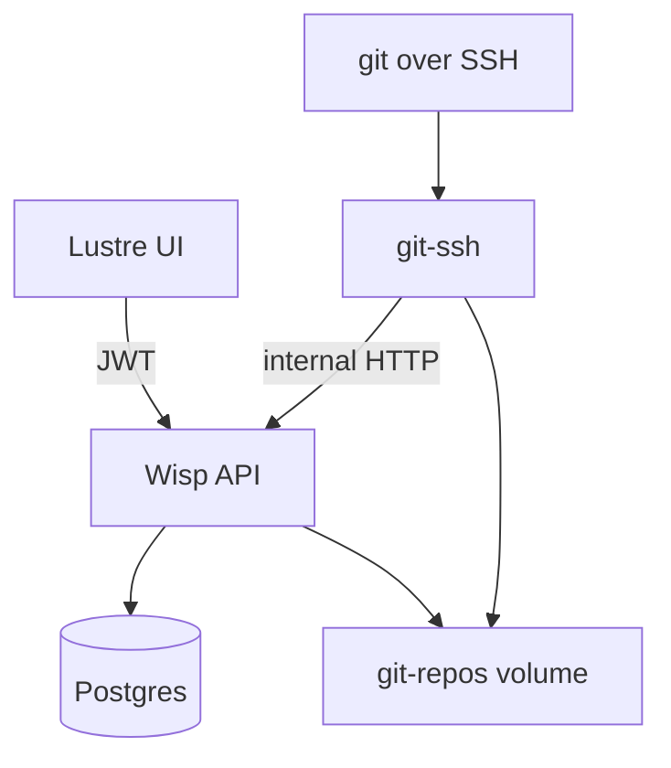

# Gleamhub

Gleam-native Git hosting MVP — multi-tenant platform (Tier 1): one deploy, all organizations.

- **Web**: Clerk sign-in, Lustre UI, Wisp API
- **Git**: SSH clone/push/pull to bare repos on disk at `{org_slug}/{repo}.git`
- **Auth**: Clerk JWT for `/api/*`; SSH public keys for git (no Bearer on git)

## Architecture



Repos live at `$GIT_REPOS_ROOT/{org_slug}/{repo}.git` (default `./data/repos` locally, `/data/repos` in Docker).

Clone URL: `ssh://git@{GLEAMHUB_GIT_HOST}:2222/{org}/{repo}.git`

## Project structure

| Path | Role |
|------|------|
| `common/` | Shared types (if needed) |
| `server/` | Wisp API, Postgres (pog), migrations, internal SSH routes |
| `ui/` | Lustre + Vite + Clerk |
| `git-ssh/` | OpenSSH + scripts calling internal API |
| `docker-compose.yml` | Postgres + server + git-ssh |

## Prerequisites

- [Gleam](https://gleam.run/getting-started/) and Erlang/OTP
- [Node.js](https://nodejs.org/) (UI + dbmate)
- [Docker](https://www.docker.com/) (optional, recommended for git-ssh + Postgres)
- A [Clerk](https://clerk.com/) application (same pattern as `estonian`)

## Quick start (Docker)

1. Copy Clerk env from **estonian** (same app for both projects):

   ```bash
   cp server/.env.example server/.env
   cp ui/.env.example ui/.env
   # Or copy directly:
   grep CLERK_JWKS ../estonian/server/.env >> server/.env
   grep VITE_CLERK ../estonian/ui/.env >> ui/.env
   ```

   Estonian pattern: `CLERK_JWKS` (single RSA JWK) in `server/.env`, `VITE_CLERK_PUBLISHABLE_KEY` in `ui/.env`. Gleamhub uses the same `verify_key.decoder()` and `clerk` middleware as estonian.

2. Build and start the platform:

   ```bash
   docker compose up --build
   ```

   - API + SPA: http://localhost:9999
   - Git SSH: `localhost:2222` (user `git`)
   - Migrations run automatically on server start

3. For UI development against the API, in another terminal:

   ```bash
   cd ui && npm install && npm run dev
   ```

   Visit http://localhost:5173 (CORS allows 5173 → API on 9999).

## Local development (without Docker server)

1. Start Postgres (or `docker compose up postgres -d`). Compose publishes **5432** to the host so local `gleam run` can use `DATABASE_URL=...@127.0.0.1:5432/gleamhub`.

2. Migrate and run the server:

   ```bash
   cd server
   cp .env.example .env   # set CLERK_JWKS
   npm install
   npm run db:up
   gleam run
   ```

   SQL queries live in `server/src/app/sql/*.sql`. After changing them, regenerate typed pog code:

   ```bash
   cd server
   npm run db:gen:sql    # gleam run -m squirrel → src/app/sql.gleam
   ```

   Requires `DATABASE_URL` (from `.env`) and an up-to-date schema (`npm run db:up`).

3. Build UI into `server/priv/static` or use Vite dev:

   ```bash
   cd ui
   cp .env.example .env
   npm install
   npm run dev          # dev server
   # or: npm run build  # production assets for Wisp
   ```

4. Git over SSH still needs `git-ssh` (Docker is easiest):

   ```bash
   docker compose up git-ssh -d
   # Ensure server is reachable from git-ssh at GLEAMHUB_API_URL=http://host.docker.internal:9999
   # on Linux you may need extra_hosts in compose for the server service
   ```

   For full local git, run `docker compose up` so server and git-ssh share the `git-repos` volume.

## End-to-end verification

1. Open http://localhost:9999 (or Vite on 5173) and sign in with Clerk.
2. **Organizations** → create org (e.g. `acme`).
3. Open the org → **Create repository** (e.g. `demo`).
4. **SSH keys** → paste your `~/.ssh/id_ed25519.pub` (or generate one).
5. Clone and push:

   ```bash
   git clone ssh://git@localhost:2222/acme/demo.git
   cd demo
   echo "# hello" >> README.md
   git add README.md && git commit -m "init"
   git push origin main
   ```

6. Confirm bare repo on disk:

   ```bash
   ls -la server/data/repos/acme/demo.git   # local server
   # or inside compose:
   docker compose exec server ls -la /data/repos/acme/demo.git
   ```

## API surface

| Route | Auth |
|-------|------|
| `GET/POST /api/orgs` | Clerk JWT |
| `GET /api/orgs/:slug` | Clerk JWT + member |
| `GET/POST /api/orgs/:slug/repos` | Clerk JWT + member |
| `GET/POST/DELETE /api/ssh-keys` | Clerk JWT |
| `GET /internal/ssh/authorized_keys?k=` | Docker network only |
| `GET /internal/ssh/access?org=&repo=&user_id=&op=` | Docker network only |

Git ops: org members with a registered key can **read** (`upload-pack`) and **write** (`receive-pack`) to all repos in that org (MVP — no per-repo ACL).

## Environment variables

| Variable | Default | Description |
|----------|---------|-------------|
| `SECRET_KEY_BASE` | (required) | Wisp session signing |
| `DATABASE_URL` | (required) | Postgres connection |
| `CLERK_JWKS` | required | Single RSA JWK JSON — copy from `estonian/server/.env` |
| `GIT_REPOS_ROOT` | `./data/repos` | Bare repo root |
| `GLEAMHUB_GIT_HOST` | `localhost` | Host in clone URLs |
| `PORT` | `9999` | HTTP port |
| `VITE_CLERK_PUBLISHABLE_KEY` | (required in UI) | Clerk frontend key |

## Deployment model (Tier 1)

Single platform deployment: one Wisp process, one git-ssh service, one Postgres, one volume. Updating the image updates every organization. Dedicated per-org stacks (Tier 2) are out of scope for this MVP.

## License

MIT — see [LICENSE.md](LICENSE.md).
