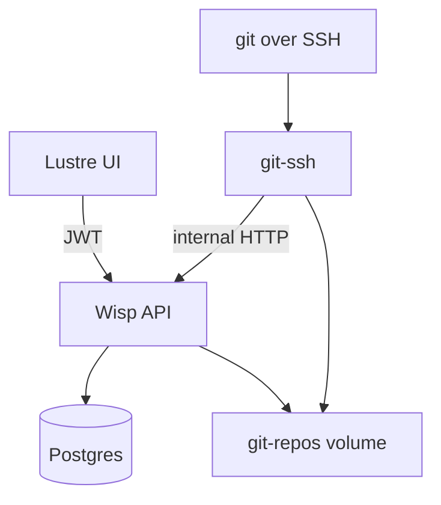

# Gleamhub

Gleam-native Git hosting MVP: Clerk sign-in, orgs/repos in the browser, SSH clone/push/pull to bare repos on disk.

## 5-minute setup

**You need:** [Docker](https://www.docker.com/), a [Clerk](https://clerk.com/) app (or the example env files), and—for local Gleam/Node work—[asdf](https://asdf-vm.com/) or [mise](https://mise.jdx.dev/):

```bash
git clone https://github.com/nathanjohnson320/gleamhub.git
cd gleamhub
asdf install   # or: mise install — reads .tool-versions (gleam, erlang, nodejs)
```

```bash
# 1. Env files (edit only if you use your own Clerk app — see below)
cp .env.example .env
cp server/.env.example server/.env
cp ui/.env.example ui/.env

# 2. Start Postgres, API, git-ssh, and built UI
docker compose up --build
```

In a **second terminal** (hot-reload UI — recommended for frontend work):

```bash
cd ui && npm install && npm run dev
```

| What | URL |
|------|-----|
| App (production build from Docker) | http://localhost:9999 |
| App (Vite dev — use this while hacking UI) | http://localhost:5173 |
| Git SSH | `ssh://git@localhost:2222/{org}/{repo}.git` |

Sign in → **Organizations** → create an org → add a repo → **SSH keys** → paste your public key → clone/push (see [Try git over SSH](#try-git-over-ssh)).

### Clerk (only if example keys do not work)

Use **one** Clerk application for both server and UI.

1. [Clerk Dashboard](https://dashboard.clerk.com/) → your app → **API keys** → copy **Publishable key** into `ui/.env`:

   ```bash
   VITE_CLERK_PUBLISHABLE_KEY=pk_test_...
   ```

2. Copy a signing **JWK** into **both** `/.env` (for Docker) and `server/.env` (for local `gleam run`):

   ```bash
   CLERK_JWKS='{"use":"sig","kty":"RSA","kid":"...","alg":"RS256","n":"...","e":"AQAB"}'

   CLERK_SECRET_KEY=sk_test_...
   ```

   The server expects a **single RSA JWK object** (not the full JWKS array). You can take the first key from your Clerk JWKS URL (`https://<your-clerk-domain>/.well-known/jwks.json`) or match the format in `server/.env.example`.

3. Restart: `docker compose up --build` (and `npm run dev` in `ui/` if it was already running).

If the UI shows **Unauthorized**, `CLERK_JWKS` and `VITE_CLERK_PUBLISHABLE_KEY` are from different Clerk apps or the JWK is malformed.

---

## Try git over SSH

After creating org `acme` and repo `demo` in the UI:

```bash
git clone ssh://git@localhost:2222/acme/demo.git
cd demo
echo "# hello" >> README.md
git add README.md && git commit -m "init"
git push origin main
```

First push to an empty repo on port 2222:

```bash
ssh-keygen -R '[localhost]:2222'   # if host key changed after container rebuild
```

Repos on disk: `server/data/repos/{org}/{repo}.git`

---

## Merge requests (same-repo)

After pushing a feature branch over SSH:

1. Open the repository in the UI → **Merge requests** → **New merge request**.
2. Choose **source** (your branch) and **target** (e.g. `main`), add a title, and create.
3. On the merge request page, use **Conversation**, **Commits**, and **Changes**. On **Changes**, hover a line and click **+** to leave an inline review comment (line numbers refer to the new file version); **Conversation** is for MR-wide discussion.
4. Org members with **write** access can **Merge** when Git reports no conflicts; the author (or a writer) can **Close** an open MR.

The server stores MR metadata in Postgres; diffs and merges run live against the bare repo (`git merge-base`, `git diff`, worktree merge + `update-ref`).

**Merge methods:** On an open MR, choose **Create merge commit** (default) or **Squash and merge** before confirming. Squash applies `git merge --squash` and a single commit on the target branch.

### Protected branches

Repository **owners** can protect branch names on the repo home page (no branches are protected by default).

- **GET/PUT** `/api/orgs/:org/repos/:repo/protected-branches` — members can read; only owners can update the list.
- **SSH push:** A `pre-receive` hook calls the internal ref-update API. Direct pushes to protected branches are denied (including force-push and branch deletion). Tags are not checked in this MVP.
- **Merge requests:** Server-side merges use `git update-ref` and do not run `pre-receive`, so MR merge remains the supported way to land changes on protected branches.

---

## Local development (Gleam + Vite)

For server/UI code changes without rebuilding the server image every time:

```bash
# Terminal 1 — database
docker compose up postgres -d

# Terminal 2 — API
cd server
cp .env.example .env    # CLERK_JWKS + DATABASE_URL
npm install
npm run db:up
gleam run               # http://localhost:9999

# Terminal 3 — UI
cd ui
cp .env.example .env
npm install
npm run dev             # http://localhost:5173

# Terminal 4 — git SSH (still Docker)
docker compose up git-ssh -d
```

- Vite proxies `/api` to port 9999.
- `git-ssh` uses `GLEAMHUB_API_URL=http://host.docker.internal:9999` by default (Mac/Windows). On Linux, set `GLEAMHUB_API_URL=http://172.17.0.1:9999` in `.env` if needed.

**SQL changes:** edit `server/src/app/sql/*.sql`, then:

```bash
cd server && npm run db:up && npm run db:gen:sql
```

**Ship UI into the server static bundle:**

```bash
cd ui && npm run build   # writes to server/priv/static
```

---

## Architecture



| Path | Role |
|------|------|
| `server/` | Wisp API, Postgres (pog), migrations, git read/browse APIs |
| `ui/` | Lustre + Vite + Clerk |
| `git-ssh/` | OpenSSH + scripts calling internal API |
| `docker-compose.yml` | Postgres + server + git-ssh |

Repos: `$GIT_REPOS_ROOT/{org_slug}/{repo}.git` (default `./server/data/repos` locally).

---

## API surface

| Route | Auth |
|-------|------|
| `GET/POST /api/orgs` | Clerk JWT |
| `GET /api/orgs/:slug` | Clerk JWT + member |
| `GET/POST /api/orgs/:slug/repos` | Clerk JWT + member |
| `GET /api/orgs/:slug/repos/:name` | Clerk JWT + member |
| `GET .../repos/:name/branches` | Clerk JWT + member |
| `GET .../repos/:name/readme?ref=` | Clerk JWT + member |
| `GET .../repos/:name/tree/:ref/...` | Clerk JWT + member |
| `GET .../repos/:name/blob/:ref/...` | Clerk JWT + member |
| `GET/POST /api/orgs/:slug/repos/:name/merge-requests` | Clerk JWT + member |
| `GET .../merge-requests/:number` (+ `/commits`, `/diff`, `/comments`) | Clerk JWT + member |
| `POST .../merge-requests/:number/merge` | Clerk JWT + org **write** |
| `POST .../merge-requests/:number/close` | Clerk JWT + author or **write** |
| `GET/POST/DELETE /api/ssh-keys` | Clerk JWT |
| `GET /internal/ssh/authorized_keys` | Docker network only |
| `GET /internal/ssh/access` | Docker network only |

Org members with a registered SSH key can read/write all repos in that org (MVP — no per-repo ACL).

---

## Environment variables

| Variable | Where | Description |
|----------|-------|-------------|
| `CLERK_JWKS` | `/.env`, `server/.env` | Single RSA JWK JSON for JWT verification |
| `CLERK_SECRET_KEY` | `server/.env` | Clerk secret key (`sk_…`) for Backend API user lookups (comment author names) |
| `VITE_CLERK_PUBLISHABLE_KEY` | `ui/.env` | Clerk publishable key |
| `SECRET_KEY_BASE` | `/.env`, `server/.env` | Wisp session signing |
| `DATABASE_URL` | `server/.env` | Postgres (Docker sets this in compose) |
| `GIT_REPOS_ROOT` | `server/.env` | Bare repo directory |
| `GLEAMHUB_GIT_HOST` | `/.env` | Hostname in clone URLs (`localhost`) |
| `GLEAMHUB_API_URL` | `/.env` | git-ssh → API URL when server runs on host |

---

## Deployment

Single platform deployment: one Wisp process, one git-ssh service, one Postgres, one shared repo volume. Per-org dedicated stacks are out of scope for this MVP.

## License

MIT — see [LICENSE.md](LICENSE.md).
