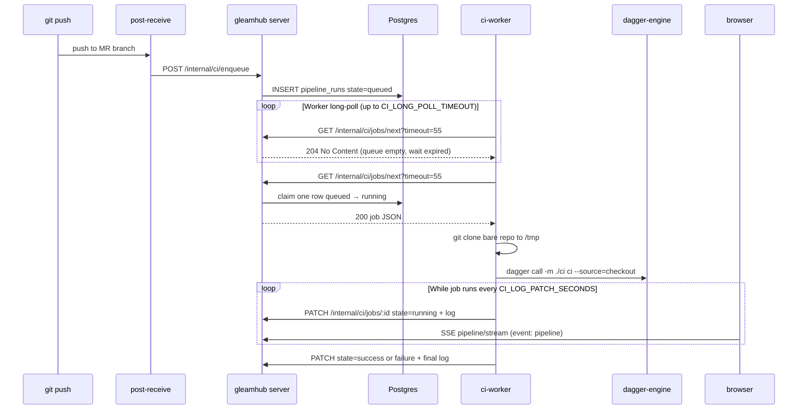

# Gleamhub CI platform

Gleamhub runs **hosted-repo CI** on your infrastructure using [Dagger](https://dagger.io/). Each repository opt-in by committing a Dagger module; gleamhub executes it on merge-request events and reports status on the MR page.

## Repo author contract

### Module location (first match wins)

1. `.dagger/dagger.json`
2. `ci/dagger.json`
3. `dagger/dagger.json`

### Entry function

Gleamhub invokes the function named **`ci`**.

### Local development

From your repository root:

```bash
dagger call -m ./ci ci --source=.
```

Use the same command gleamhub's worker runs in CI. Pin the Gleam container image in your module to the version in the repo’s `.tool-versions` or `gleam.toml` — using a newer compiler than the project expects produces version-constraint errors during `gleam deps download` / `gleam test`.

### Example modules

Commit a `ci/` directory with `dagger.json` and a `ci` function (TypeScript, Go, or Python SDK). A minimal smoke test can run a single shell command; a Phoenix app can use a Dagger Postgres service and `mix test` with `Ecto.Adapters.SQL.Sandbox` (see the `test-ci` branch on hosted repos like `html-to-lustre`).

## When CI runs (v1)

MR pipelines only:

- Opening a merge request enqueues a run for the source branch HEAD
- Pushing to an open MR's source branch enqueues a run for the new commit
- Writers can **Re-run checks** from the MR page

Pushes to branches that are not the source branch of an open MR do not enqueue runs.

## Merge gating

| Git state | Pipeline | Merge allowed |
|-----------|----------|---------------|
| Conflicts | any | No |
| Clean | No module (`skipped`) | Yes |
| Clean | `queued` / `running` | No |
| Clean | `failure` | No |
| Clean | `success` at current HEAD | Yes |

## Operator setup

### 1. Run gleamhub API + repos

Follow the main [README](../README.md). Repos live under `server/data/repos` by default (`GIT_REPOS_ROOT`).

### 2. Start the CI stack

```bash
docker compose -f docker-compose.ci.yml up --build -d
```

Services:

- **`dagger-engine`** — persistent Dagger engine (`container_name: gleamhub-dagger-engine`; the worker uses `container://gleamhub-dagger-engine`, not the compose service name)
- **`ci-worker`** — long-polls gleamhub for jobs, clones the bare repo into `/tmp`, runs `dagger call`, and PATCHes `log` every few seconds while the job runs (shown on the MR **Checks** tab via SSE)

**Dagger version:** CLI and engine are pinned together (currently **v0.21.3**) in `ci-worker/Dockerfile` (`DAGGER_VERSION`), `docker-compose.ci.yml` (`registry.dagger.io/engine:…`), and each repo’s `ci/dagger.json` (`engineVersion`). After bumping, rebuild both services: `docker compose -f docker-compose.ci.yml up --build -d`.

Environment (via `.env` or shell):

| Variable | Purpose |
|----------|---------|
| `GLEAMHUB_API_URL` | gleamhub API base URL (default `http://host.docker.internal:9999`) |
| `INTERNAL_API_TOKEN` | Must match gleamhub server token |
| `GIT_REPOS_ROOT` | Mounted read-only into worker (default `./server/data/repos`) |
| `CI_LONG_POLL_TIMEOUT` | Seconds the server holds `GET /internal/ci/jobs/next` before `204` (default `55`) |
| `CI_POLL_SECONDS` | Worker sleep after a failed `jobs/next` request (default `5`) |
| `CI_LOG_PATCH_SECONDS` | How often the worker uploads partial logs while a job runs (default `3`) |
| `CI_JOB_TIMEOUT_SECONDS` | Max job duration (default `1800`) |

### 3. Git hooks

New repos receive **`post-receive`** hooks automatically (alongside `pre-receive`). Existing repos get hooks reinstalled when protected branches are updated. Hooks call `POST /internal/ci/enqueue` after successful pushes.

## How it works (end to end)

The worker uses **long polling** on `GET /internal/ci/jobs/next`: the server blocks up to `CI_LONG_POLL_TIMEOUT` (default 55s) and returns `200` as soon as a job is claimable, or `204` when the wait times out. You should see far fewer idle log lines than with short polling.

### Components

| Piece | Role |
|-------|------|
| **gleamhub server** (`gleam run` in `server/`) | HTTP API, Postgres (`pipeline_runs`), enqueues jobs, serves MR UI JSON |
| **git-ssh** + bare repos | `post-receive` calls enqueue after push; repos under `server/data/repos` |
| **ci-worker** (Docker) | Long-poll loop: claim job → clone → `dagger call` → PATCH status/log |
| **dagger-engine** (Docker) | Runs pipeline containers; worker talks to it via `container://gleamhub-dagger-engine` |
| **UI** | MR **Checks** tab opens an SSE stream (`GET …/pipeline/stream`) for live log/state; MR list shows latest check state |



### Pipeline states (`pipeline_runs.state`)

| State | Meaning |
|-------|---------|
| `queued` | Waiting for a worker to claim the job |
| `running` | Worker claimed it and is executing (or uploading logs) |
| `success` | `dagger call` exited 0 |
| `failure` | Non-zero exit, timeout (124), or worker error |
| `skipped` | No `ci/dagger.json` (etc.) at that commit — merge allowed |

Stale `queued` (>10m) and `running` (>5m) rows are reclaimed automatically when something calls `jobs/next` or opens an MR (marks failure with a short message).

### Worker long poll (`jobs/next`)

`ci-worker/run.sh` runs forever:

1. `GET /internal/ci/jobs/next?timeout=<CI_LONG_POLL_TIMEOUT>` with `X-Gleamhub-Internal-Token` (curl `--max-time` is timeout + 10s).
2. **`204 No Content`** — no `queued` jobs within the wait window. Worker immediately starts another long poll (no sleep on idle).
3. **`200 OK`** — body is job metadata (`id`, `org_slug`, `repo_name`, `disk_path`, `commit_sha`, `module_path`, …). Server atomically set that row to `running`.
4. Worker clones `GIT_REPOS_ROOT/<disk_path>` to `/tmp`, checks out `commit_sha`, runs `dagger call --progress=plain -m <module> ci --source=<checkout>`.
5. While Dagger runs, every `CI_LOG_PATCH_SECONDS` (default **3**): `PATCH /internal/ci/jobs/:id` with `{"state":"running","log":"..."}` (log capped at 256KB client-side).
6. When Dagger finishes: `PATCH` with `state` `success` or `failure` and full log.

So: **204 after a long wait = worker is healthy but idle**; **200 = a job started**. If MRs stay “Waiting for CI worker…” with no `200` on `jobs/next`, the worker is not reaching the API (wrong `GLEAMHUB_API_URL` / token) or nothing was enqueued. On HTTP errors the worker sleeps `CI_POLL_SECONDS` before retrying.

### UI live updates (SSE)

On the MR **Checks** tab the browser opens:

`GET /api/orgs/:org/repos/:repo/merge-requests/:number/pipeline/stream`

Authenticated with the same Clerk bearer token as other API calls (via `fetch` streaming, not `EventSource`). The server pushes `event: pipeline` messages with the same JSON shape as `pipeline` on MR detail. Updates are published when a run is enqueued, claimed, or patched. The stream closes when the run reaches `success`, `failure`, or `skipped`.

### When jobs are enqueued

| Trigger | What happens |
|---------|----------------|
| Push to branch that is the **source branch of an open MR** | `post-receive` → `POST /internal/ci/enqueue` → new `queued` row if SHA is new for that MR |
| **Open MR** (API) | Same enqueue for source branch HEAD |
| **Re-run checks** (UI) | New `queued` row at current HEAD (`trigger=manual`) |
| Push with **no** open MR on that branch | Hook runs but server does not create a run |

Enqueue discovers `ci/dagger.json` (or `.dagger/` / `dagger/`) at `commit_sha` in the bare repo. No module → single row with `skipped` (no worker job).

### UI behaviour

- **MR list** — `GET /merge-requests` includes each MR’s latest pipeline summary (`state` only, no log).
- **MR detail / Checks tab** — initial `pipeline` on `GET .../merge-requests/:n`; while `queued` or `running`, the **Checks** tab uses SSE (`GET .../merge-requests/:n/pipeline/stream`) for live log and state, then one final `GET` when the run finishes (merge gating).
- Tab choice is preserved in the URL hash (`#checks`, etc.).

### Quick checks

```bash
# Worker container talking to API?
docker logs gleamhub-ci-worker-1 --tail 20

# Anything queued or stuck?
# (from host, against gleamhub Postgres)
psql ... -c "SELECT state, left(commit_sha,8), created_at FROM pipeline_runs ORDER BY created_at DESC LIMIT 5;"

# Manual claim (returns 204 or job JSON) — needs INTERNAL_API_TOKEN
curl -s -o /dev/null -w '%{http_code}\n' -H 'X-Gleamhub-Internal-Token: …' 'http://localhost:9999/internal/ci/jobs/next?timeout=55'
```

## Internal API

| Endpoint | Method | Role |
|----------|--------|------|
| `/internal/ci/enqueue` | POST | Enqueue runs for open MRs matching branch + commit |
| `/internal/ci/jobs/next` | GET | Worker long-polls for next queued job (`?timeout=`, default 55s; 204 if none before timeout) |
| `/api/.../merge-requests/:n/pipeline/stream` | GET | SSE pipeline updates (Clerk auth; event `pipeline`) |
| `/internal/ci/jobs/:id` | PATCH | Worker updates state + log (`{"state":"success","log":"..."}`) |

Authenticated with header `X-Gleamhub-Internal-Token`.

## Public API

MR detail includes:

```json
{
  "merge_request": { ... },
  "merge_check": { "mergeable": true, "message": "" },
  "pipeline": {
    "state": "success",
    "commit_sha": "...",
    "module_path": "ci",
    "log": "..."
  }
}
```

`pipeline` is `null` when no run exists yet.

## Troubleshooting stuck checks

**Symptoms:** Checks stay on “running” for many minutes; the log stops on Dagger lines such as `loading type definitions` or Postgres `checkpoint` messages.

**What is usually happening:**

1. **Buffered logs** — Dagger only flushes `withExec` output when a step finishes. Long `mix deps.get` / `mix test` steps can look frozen even while work continues.
2. **Hung step** — If the Dagger engine log shows `starting container` for `mix deps.get` but no matching `container done` for several minutes, the Elixir container is stuck (network to Hex, resource limits, etc.).
3. **Stale UI after reclaim** — Runs in `running` for more than 5 minutes are marked `failure` in Postgres. An old worker process could keep PATCHing `running` and confuse the UI until it is restarted.

**What to do:**

```bash
# Stop the in-flight Dagger process and pick up the next queued job
docker compose -f docker-compose.ci.yml restart ci-worker

# Confirm the latest run state (should be failure after reclaim, or success after a good run)
docker exec gleamhub-postgres-1 psql -U postgres -d gleamhub \
  -c "SELECT state, started_at, finished_at FROM pipeline_runs ORDER BY created_at DESC LIMIT 3;"
```

Then use **Re-run checks** on the MR. In repo `ci/` modules, split long shell steps (e.g. separate `withExec` for `mix deps.get` and `mix test`) and wrap slow commands with `timeout` so failures surface in the log.

### Phoenix / Mix logs stop at “creating hex-2.4.2”

That line is the **end** of `mix local.hex`, not the hang point. Your `ci` module likely runs one shell step:

```sh
mix local.hex --force && mix local.rebar --force && mix deps.get
```

After the hex archive message, **`mix deps.get` runs with little or no output** until the whole step finishes. Dagger only streams new log lines when the `withExec` completes, so the Checks tab looks frozen on hex even while deps are downloading or compiling (often 1–10+ minutes on a cold run).

Successful runs on the same commit can finish in ~30s when Dagger reuses cached layers; after engine restarts or failures, the mix step runs cold again and looks “stuck” every time.

**Recommended `ci/src/index.ts` changes (in your repo):**

1. **Drop `mix local.hex` / `mix local.rebar`** — the `hexpm/elixir` image already ships Mix; re-installing hits `hex.pm` over the network and adds noise.
2. **Split `withExec` steps** — separate waits, `mix deps.get`, and `mix test` so logs and Dagger cache update per step.
3. **Set `MIX_ENV=test`** and optional timeouts, e.g. `HEX_HTTP_TIMEOUT=300`, for clearer failures inside the container.

Example shape:

```typescript
.withEnvVariable("MIX_ENV", "test")
.withExec(["sh", "-c", "echo '==> mix deps.get' && mix deps.get"])
.withExec(["sh", "-c", "echo '==> mix test' && mix test"])
```

On **Docker Desktop / OrbStack (Apple Silicon)**, intermittent hangs in `mix deps.get` are often container DNS or IPv6/`httpc` behaviour; if deps never finish, try `docker compose -f docker-compose.ci.yml restart dagger-engine` before re-running checks.

## Security note

Hosted-repo pipelines execute arbitrary code in containers (same trust model as shared CI runners). Run workers on isolated infrastructure and keep Docker socket access limited to the CI stack.
